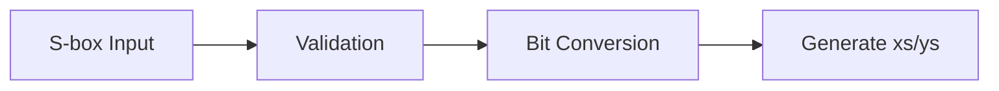
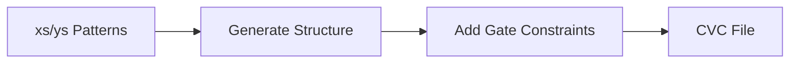
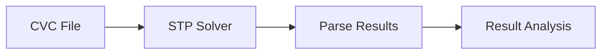
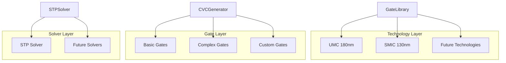

# Solver Package Architecture

This document describes the architecture of the Solver package for S-box optimization, including GEC (Gate Equivalent Circuit) and BGC (Boolean Gate Complexity) optimization methods.

## Overview

The Solver package is a modular Python package designed to optimize S-box implementations using multiple methods:
- **GEC (Gate Equivalent Circuit)**: Finding minimal gate equivalent circuits using constraint satisfaction
- **BGC (Boolean Gate Complexity)**: Optimizing boolean gate complexity (planned addition)

The package uses constraint satisfaction techniques with solvers like STP to find optimal implementations.

## Architecture Diagram

```mermaid
graph TB
    %% User Interface Layer
    CLI[gec_cli.py<br/>Command Line Interface]
    API[Python API<br/>Direct Usage]
    
    %% Core Components
    subgraph "Solver Package"
        GECOpt[GECOptimizer<br/>GEC Optimization]
        BGCOpt[BGCOptimizer<br/>BGC Optimization<br/>(Planned)]
        
        subgraph "Input Processing"
            SboxConverter[SboxConverter<br/>S-box Validation & Conversion]
        end
        
        subgraph "Problem Generation"
            CVCGenerator[CVCGenerator<br/>Constraint Generation]
            GateLibrary[GateLibrary<br/>Gate Definitions & Costs]
        end
        
        subgraph "Solver Interface"
            STPSolver[STPSolver<br/>STP Integration]
        end
        
        subgraph "Utilities"
            Utils[Utils<br/>Logging & Helpers]
        end
    end
    
    %% External Dependencies
    STP[STP Solver<br/>Constraint Solver]
    
    %% Data Flow
    CLI --> GECOpt
    API --> GECOpt
    API --> BGCOpt
    
    GECOpt --> SboxConverter
    GECOpt --> CVCGenerator
    GECOpt --> STPSolver
    GECOpt --> Utils
    
    BGCOpt --> SboxConverter
    BGCOpt --> Utils
    
    SboxConverter --> GECOpt
    SboxConverter --> BGCOpt
    CVCGenerator --> GateLibrary
    CVCGenerator --> STPSolver
    STPSolver --> STP
    
    %% Output
    GECOpt --> Results[Optimization Results<br/>Gate Circuits & Statistics]
    BGCOpt --> Results
    
    %% Styling
    classDef interface fill:#e1f5fe
    classDef core fill:#f3e5f5
    classDef external fill:#fff3e0
    classDef output fill:#e8f5e8
    
    class CLI,API interface
    class GECOpt,BGCOpt,SboxConverter,CVCGenerator,GateLibrary,STPSolver,Utils core
    class STP external
    class Results output
```

## Component Descriptions

### 1. **GECOptimizer** (`gec_optimizer.py`)
- **Current Implementation**: Fully implemented GEC optimization
- **Role**: Main orchestrator that coordinates the entire optimization process
- **Responsibilities**:
  - Manages optimization workflows (default, exhaustive, exact gate analysis)
  - Coordinates between all components
  - Implements search strategies and structure exploration
  - Analyzes and reports results
- **Key Methods**:
  - `optimize_sbox()` - Default optimization strategy
  - `optimize_sbox_exhaustive()` - Exhaustive search strategy
  - `find_all_solutions_for_gates()` - Exact gate count analysis

### 2. **BGCOptimizer** (`bgc_optimizer.py`) - **Planned Addition**
- **Future Implementation**: Boolean Gate Complexity optimization
- **Role**: Optimizer for BGC-based S-box analysis
- **Planned Responsibilities**:
  - BGC-specific optimization workflows
  - Boolean complexity analysis
  - Integration with existing solver infrastructure
- **Key Features** (Planned):
  - Multiple BGC optimization strategies
  - Boolean circuit analysis
  - Cost optimization for boolean implementations

### 3. **SboxConverter** (`sbox_converter.py`)
- **Role**: Handles S-box validation and bit-level decomposition
- **Responsibilities**:
  - Validates S-box inputs (permutation checking)
  - Converts S-box values to bit representation
  - Generates input variable patterns (xs) and output patterns (ys)
- **Key Features**:
  - Support for different bit widths (3-bit, 4-bit, etc.)
  - Comprehensive S-box validation
  - Bit decomposition for constraint generation

### 3. **CVCGenerator** (`cvc_generator.py`)
- **Role**: Generates CVC format constraint files for the STP solver
- **Responsibilities**:
  - Creates constraint satisfaction problems in CVC format
  - Encodes gate behavior and circuit structure constraints
  - Generates depth-based circuit structures
- **Key Features**:
  - Multiple gate type support
  - Technology-specific cost constraints
  - Flexible circuit depth structures

### 4. **GateLibrary** (`gate_library.py`)
- **Role**: Manages gate definitions and technology cost models
- **Responsibilities**:
  - Defines supported gate types (XOR, AND, OR, NOT, etc.)
  - Provides cost models for different process technologies
  - Manages gate encoding and constraints
- **Supported Technologies**:
  - UMC 180nm process
  - SMIC 130nm process
- **Gate Types**:
  - Basic: XOR, XNOR, AND, NAND, OR, NOR, NOT
  - Complex: XOR3, XNOR3, AND3, NAND3, OR3, NOR3, MAOI1, MOAI1

### 5. **STPSolver** (`stp_solver.py`)
- **Role**: Interface to the STP constraint solver
- **Responsibilities**:
  - Executes STP solver with generated CVC files
  - Parses solver output and results
  - Handles solver timeouts and errors
  - Supports multi-threading for performance
- **Key Features**:
  - Configurable solver timeouts
  - Multi-threaded solving support
  - Result parsing and validation
  - Error handling and logging

### 6. **Utils** (`utils.py`)
- **Role**: Provides utility functions and logging setup
- **Responsibilities**:
  - Configurable logging system
  - Helper functions for bit manipulation
  - Common utilities used across components
- **Key Features**:
  - Structured logging with multiple levels
  - File and console output support
  - Bit conversion utilities

## Data Flow

### 1. **Input Processing**


### 2. **Constraint Generation**


### 3. **Solving Process**


## Search Strategies

The architecture supports multiple search strategies implemented in the `GECOptimizer`:

### 1. **Default Strategy**
- Optimizes for minimal gate count
- Stops on first satisfiable solution
- Tests structures in decreasing gate count order

### 2. **Exhaustive Search**
- Finds all possible solutions within constraints
- Explores all depth structures for each gate count
- Provides comprehensive solution space analysis

### 3. **Exact Gate Analysis**
- Finds all solutions for a specific gate count
- Useful for comparing structural alternatives
- Provides detailed analysis of design trade-offs

### 4. **Structure Exploration**
- Tests all depth structures systematically
- Balances completeness with performance
- More thorough than default, faster than exhaustive

## Technology Integration

The architecture is designed for extensibility:



## Performance Considerations

### **Parallel Processing**
- Multi-threaded STP solver execution
- Configurable thread count for different system capabilities
- Optimal thread allocation for memory-constrained environments

### **Optimization Strategies**
- Structure filtering before constraint solving
- Gate count ordering (fewer gates prioritized)
- Early termination for time-constrained scenarios

### **Memory Management**
- Efficient constraint generation
- Minimal memory footprint for large problems
- Cleanup of temporary files and resources

## Extensibility Points

The architecture provides several extension points:

1. **New Technologies**: Add cost matrices to `GateLibrary`
2. **New Gate Types**: Extend gate definitions and encoding in `GateLibrary`
3. **New Solvers**: Implement solver interface in `STPSolver`
4. **New Constraints**: Extend constraint generation in `CVCGenerator`
5. **New Search Strategies**: Add optimization methods to `GECOptimizer`

## Configuration and Customization

The system supports extensive configuration:

- **Logging**: Configurable levels, file output, structured logging
- **Solver**: Timeout settings, thread count, solver path
- **Optimization**: Gate constraints, technology selection, search strategy
- **Output**: Result format, verbosity, file organization

This modular architecture ensures maintainability, extensibility, and performance while providing a clean separation of concerns for S-box optimization tasks.